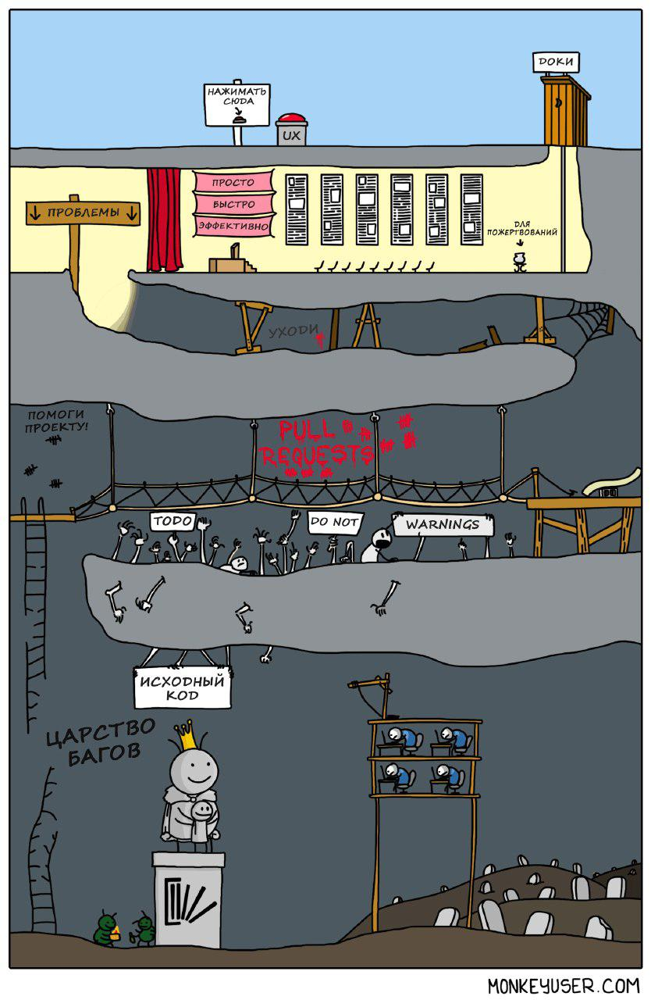

# Agile Lite для менеджеров

Работать с командой разработчиков не простая задача в вашей компании? Встречались ли вам проекты, которые постоянно не укладываются в оговоренные сроки выполнения? Работали ли вы с разработчиками, которые активно начинали разработку какого-либо  проекта, а потом медленно охладевали к нему или, вовсе, покидали проект? Возможно вы просто имели дело с талантливыми разработчиками, испытывающими состояние выгорания при работе над проектом.

Выгорание это довольно частое эмоциональное состояние команд разработчиков в IT сфере, приводящее к краху проекта над которым они работают. Выгорание может быть описано как симптомы посттравматического стрессового расстройства, свзянного с работой над проектом или в конкретной организации. Например, мозг человека находящегося в таком состоянии может отключаться и он может испытывать сильную тревогу при упоминании одного лишь названия проекта. Разработчик в таком состоянии, скорее всего, не сможет продолжать работу над таким проектом и может испытывать снижение производительности при работе над другими проектами. Также выгорание может нанести серьезный вред карьере.

У состояния выгорания, существует множество причин, но все они могут быть описаны как результат напряженной работы под большим стрессом достаточно продолжительное время.

Это как ездить постоянно на машине на повышенных оборотах без добавления масла и бензина. В итоге рано или поздно двигатель выйдет из строя и его будет сложно или уже не возможно починить.

Я предлагаю решение данной проблемы. Это форма agile методологии созданная специально для исключения выгорания команды. Я называю эту методологию `Agile Lite` (Agile без выгорания).

Ее оснонвые правила следующие: 
* Каждый цикл разработки включает 3 недели спринта и 1 неделю разгрузки, в которую выполняется планирование спринта на следующий период. Мантра: **3 недели спринт / 1 неделя разгрузки**.
* Сприн включает в себя решение задач (`Issues`), и разработчики их решают, и регистрируют их выполнение в системе багтрекинга.
* Как только начался 3-х недельний сприн, в этот период никакие новые задачи не могут быть добавлены в данный спринт, только удалены/закрыты. Это исключает частые переключения разработчиков между контектсами задач и это хорошо.
* Задачей (`Issue`) является любой блок работы, который занимает от 4 до 8 часов рабочего времени разработчика и который прописан в виде описанной задачи (таска) в систему трекинга.
* Любые задачи в текущем спринте, которые не были завершены по окончанию очердного периода спринта, пересматриваются в течении периода недельной разгрузки и планирования, и переносятся в следующий 3-х недельний спринт.
* Мы отказваемся от такого понятия как переработки. У нас нет гонок на выживание. Разработчики на постоянной основе получают новые порции задач и получают необходимое время на их выполнение, а также время на разгрузку своих мозгов. Менеджерские затраты на управление при этом минимальны.

Это и есть описание методологии разработки по `Agile Lite`. Естественно вы можете подкорректировать эти описания под свои нужды. Но есть один отличительный признак Agil Lite, который я хотел бы отметить - это то, что мы явно говорим: "Эй, команды работающие по методологии agile тоже могут выгорать также как и команды работающие по другим методологиям, возможно нам надо добавить еще некоторых правил, чтобы уменьшить вероятность выгорания нашего движка, которым явялется наша команда".

Давайте прекратим перегревать наши движки! У нас итак много работы, которую мы должны сделать. По сути бездонная яма работы. Но жизнь коротка, чтобы тратить ее всю на работу, стресс и выгорание.

----

If you would like to see more workplaces implement a system such as this, please star this repo on github and share on social media to increase visibility.
Dave Sullivan 2019 dave.brian.sullivan@gmail.com

----

Источник: [Agile_Lite_for_Managers](https://github.com/davebs/AgileLite/blob/master/agile_lite_for_managers.md)

